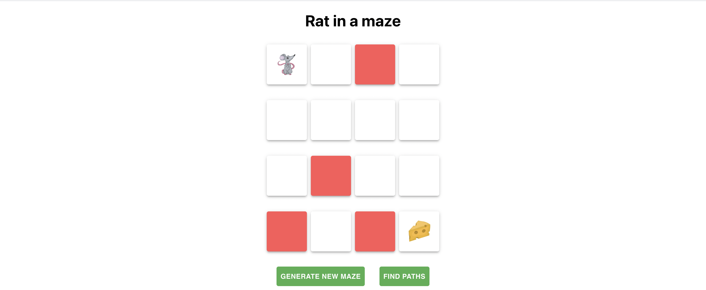
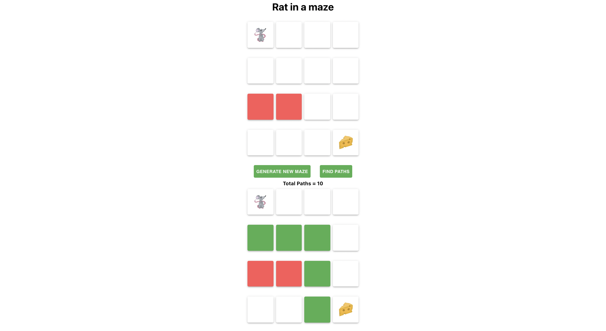
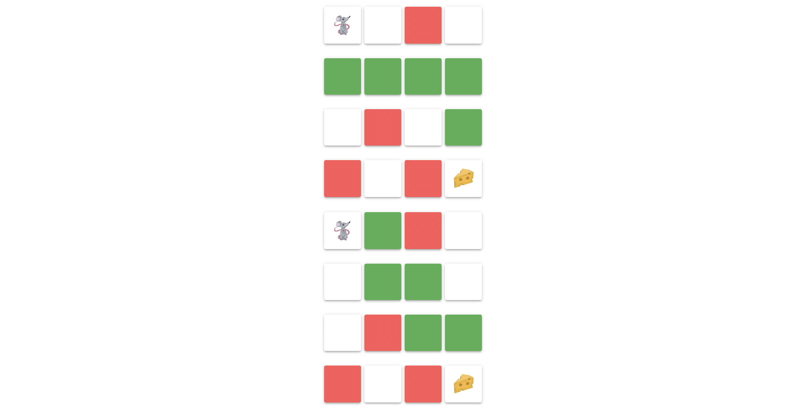

# Rat in a maze app

## Description

- A 4x4 matrix where the program finds all the possible ways to go from source (top left) to destination (bottom right)
- A final assignment of Data Structures course @ Business College Helsinki

## Functionalities

- Generate a new random maze
- Find all possible paths for the rat to go to the cheese

## Data structure concepts used

- Recursion
- Backtracking

## Acknowledgements

Our course teacher [Santosh Kalwar] (https://github.com/kalwar) taught us how to build this app.
